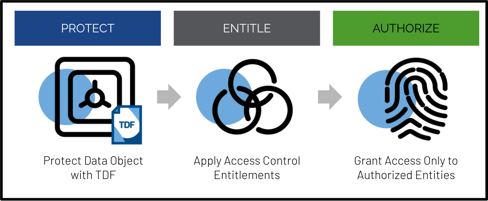

# OpenTDF 

OpenTDF is an open source project that provides developers with the tools to build data protections natively within their applications using the Trusted Data Format (TDF). 

TDF is a data object wrapper that allows data owners to cryptographically protect their data and easily dictate data access controls. It can protect virtually any electronic data type.

TDF was developed specifically to protect highly sensitive Intelligence Community (IC) data. It is an open standard and the Office of the Director of National Intelligence (ODNI) currently maintains its standards and specifications, which you can read more about here. 

OpenTDF takes these standards and has evolved them for specific use cases like file and email protection, creating (and maintaining) a specification built on these same standards, which you can read more about here.

OpenTDF adds clients and services using these TDF standards, in order to make it easier to apply both TDF protections and data access controls to whatever data you need to protect within your applications. 

Understanding that controlling data access by enabling easy data sharing with those who should have data access while ensuring powerful data protection against those who should not have data access is key in any zero trust framework, OpenTDF has adopted the NIST framework for Attribute Based Access Controls (ABAC). ABAC provides an extensible access control framework beyond Role Based Access Controls (RBAC), allowing for extremely granular access controls that “live” with the data throughout its lifespan, wherever it travels. 

## Evaluate

Do you want a quick demonstration of OpenTDF? See [Quickstart](quickstart)

## Integrate

Ready to begin integrating into your system?  Start a local, blank cluster.   
See [Integrate](integrate)

### API

Review the RESTful API documentation.

### Examples

Review examples to see how to integrate. See [Examples](examples)

## Deploy

Ready to deploy to production? Review our Helm chart install and configuration

## Contribute

To contribute, follow the Development section in the corresponding READMEs.   
Reference the license and code of conduct in the About section.
