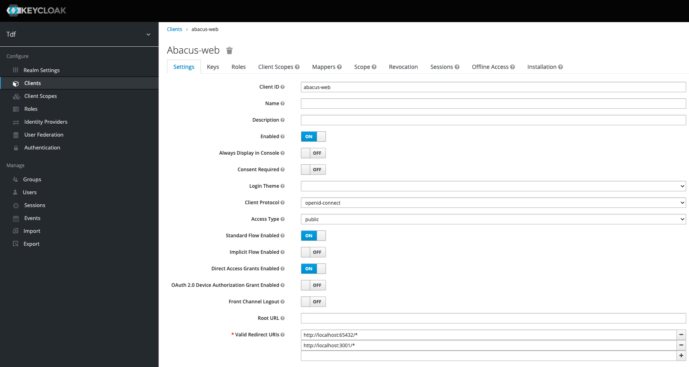
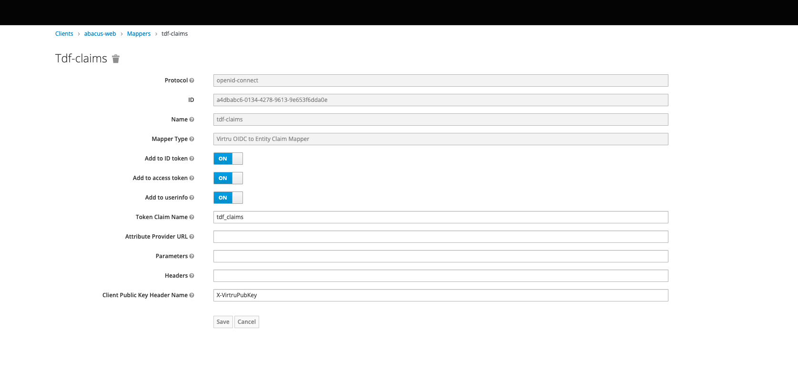

# README

### Purpose

- A practical React based example of OIDC authentication against Keycloak using OpenTDF's [client-web](https://github.com/opentdf/client-web) SDK to send encrypted TDF streams, or download/decrypt TDF streams, to and from an S3 compatible remote store

### Starting Infrastructure
- Follow the instructions at [documentation/quickstart](https://github.com/opentdf/opentdf/tree/main/quickstart) to start the required backend services

- Once all services are up and running open the `Keycloak` console at `http://localhost:65432/auth` to configure the browser client to support this app

   - UserName: `keycloakadmin`
   - Password: `mykeycloakpassword`

- Navigate to the `abacus-web` client in the `tdf` realm of `Keycloak` and add `http://localhost:3001/*` to the list of `Valid Redirect URIs`. Be sure to save your changes at the bottom of the form.

- Navigate to the `Mappers` tab of the `abacus-web` client in the realm `tdf`. Here we'll add the appropriate mapper for the client to be able to apply claims

### Starting Application

- Install dependencies: `npm i`
- Start app in local development mode: `npm run serve`
- Generate a production bundle: `npm run build`
