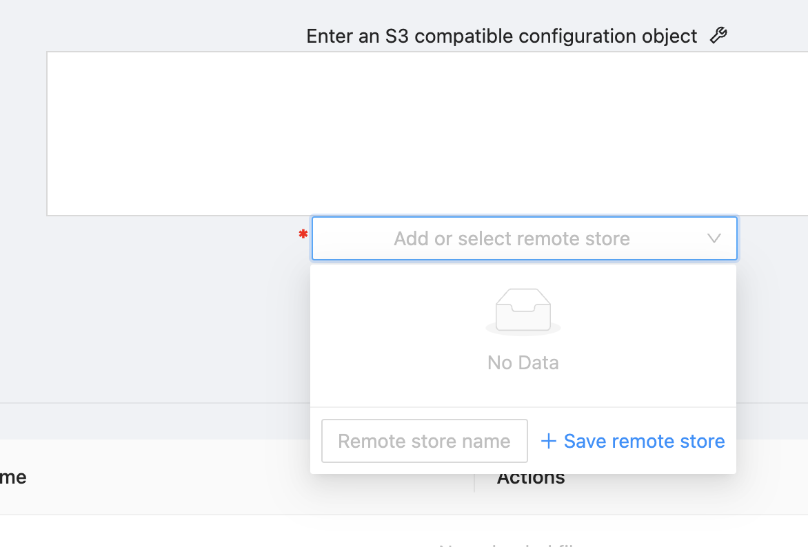

# Secure Remote Storage

### Purpose

- A practical React based example of OIDC authentication against Keycloak using OpenTDF's [client-web](https://github.com/opentdf/client-web) SDK to send encrypted TDF streams, or download/decrypt TDF streams, to and from an S3 compatible remote store.

### Usage

- An overview of the different UI features is listed below using the red annotated numbers in the image below.

1. Login/logout button, credentials for logging in are described below in the portion of the README titled [Starting Application](#starting-infrastructure).
2. Local file selection button, this selects a file to encrypt/upload to an S3 compatible remote store.
3. Remote store configuration object text box, here a user enters an S3 compatible configuration object in JSON format, this configuration defines the location where files will be encrypted and uploaded to.
4. An optional dropdown menu that allows users to save a S3 compatible configuration object for future reference, this enables easy and fast switching between multiple bucket locations. To use this feature enter a compatible configuration object in the text box as described on step 3, and in the drop down enter a name to reference the bucket as. After clicking `+ Save remote store` your remote store will be listed in the dropdown menu as a selectable store.

5. Encrypt and Upload button, this button starts the upload and encryption process assuming a user is logged in, has selected a file, and has entered a valid S3 compatible configuration object.
6. Uploaded files table, this table lists files that have been successfully uploaded by the UI and encrypted into the TDF (Trusted Data Format) format. Uploaded files offer a download button next to them which will download and decrypt the hosted file listed in the table onto your local filesystem.

### Starting Infrastructure
- Follow the instructions at [documentation/quickstart](https://github.com/opentdf/opentdf/tree/main/quickstart) to start the required backend services.

- Once all services are up and running open the `Keycloak` console at `http://localhost:65432/auth` to configure the browser client to support this app.

   - Username: `keycloakadmin`
   - Password: `mykeycloakpassword`

- Navigate to the `abacus-web` client in the `tdf` realm of `Keycloak` and add `http://localhost:3001/*` to the list of `Valid Redirect URIs`. Be sure to save your changes at the bottom of the form.

- Navigate to the `Mappers` tab of the `abacus-web` client in the realm `tdf`. Here we'll add the appropriate mapper for the client to be able to apply claims.

### Starting Application

- Install dependencies: `npm i`
- Start app in local development mode: `npm run serve`

   - Application will be hosted at `http://localhost:3001`
   - Authenticate via the app's login flow with

      - Username: `user1`
      - Password: `testuser123`

- Generate a production bundle: `npm run build`
