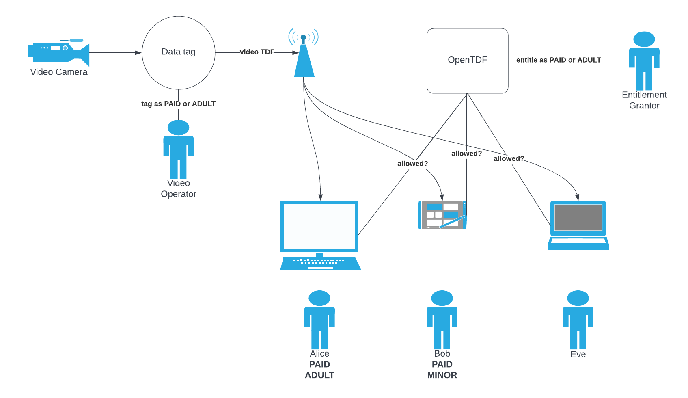

# webcam-app 
Full-motion video with OpenTDF

## Topics covered

- Protect a video stream via data tagging with attributes
- Entitle users and web apps to view the video stream

## Steps

1. Click **Login** to login all users using OIDC
2. Click **Webcam** to start your webcam and the video stream
3. As the _Video Operator_, click **Premier** to tag the video stream for consumption by paid users only (Alice, Bob)
4. As the _Entitlement Grantor_, click **Abacus**, login user1/testuser123, go to **Entitlements** and remove _Premier_ from Alice

## Setup

1. Start Quickstart
2. Go to Abacus, http://localhost:65432/auth/ , login keycloakadmin/mykeycloakpassword
3. Create users: alice, bob, eve with password testuser123
4. Create client `localhost-webcam-app`, add root url `http://localhost:3000`, add "Virtru OIDC to Entity Claim Mapper"
5. Create attribute authority in Abacus
   1. Login user1/testuser123 
   2. Namespace `https://opentdf.us`
6. Create attribute in Abacus
   1. Name `X-ContentExclusivity`, Rule `Hierarchy`, Order `Premier` and `Basic`
   2. Name `X-AudienceGuidance`, Rule `Hierarchy`, Order `Restricted`, `Parental`, and `All`
7. Entitle client `localhost-webcam-app` with `X-ContentExclusivity`: `Premier` and `X-AudienceGuidance`: `Restricted`
8. Entitle user alice with `X-ContentExclusivity`: `Premier` and `X-AudienceGuidance`: `Restricted`
9. Entitle user bob with `X-ContentExclusivity`: `Premier` and `X-AudienceGuidance`: `All`
10. `npm run start` - follow Steps above 
