# openTDF Integrate

**_Not for production_**

For local development

## Overview

[OpenID Connect](https://openid.net/connect/) (OIDC) is used by openTDF.

[Keycloak](https://www.keycloak.org/) is used for identity management.

[PostgreSQL](https://www.postgresql.org/) is the database.

## Prerequisites

- Install [Docker](https://www.docker.com/)

  - see https://docs.docker.com/get-docker/

- Install [kubectl](https://kubernetes.io/docs/reference/kubectl/overview/)

  - On macOS via Homebrew: `brew install kubectl`
  - On Linux or WSL2 for Windows: `curl -LO "https://dl.k8s.io/release/$(curl -L -s https://dl.k8s.io/release/stable.txt)/bin/linux/amd64/kubectl" && chmod +x kubectl && sudo mv kubectl /usr/local/bin/kubectl`
  - Others see https://kubernetes.io/docs/tasks/tools/

- Install [kind](https://kind.sigs.k8s.io/)

  - On macOS via Homebrew: `brew install kind`
  - On Linux or WSL2 for Windows: `curl -Lo kind https://kind.sigs.k8s.io/dl/v0.11.1/kind-linux-amd64 && chmod +x kind && sudo mv kind /usr/local/bin/kind`
  - Others see https://kind.sigs.k8s.io/docs/user/quick-start/#installation

- Install [helm](https://helm.sh/)

  - On macOS via Homebrew: `brew install helm`
  - On Linux or WSL2 for Windows: `curl -LO https://get.helm.sh/helm-v3.7.0-linux-amd64.tar.gz && tar -zxvf helm-v3.0.0-linux-amd64.tar.gz && chmod +x linux-amd64/helm && sudo mv linux-amd64/helm /usr/local/bin/helm`
  - Others see https://helm.sh/docs/intro/install/

- Install [Tilt](https://tilt.dev/)
  - On macOS via Homebrew: `brew install tilt-dev/tap/tilt`
  - On Linux or WSL2 for Windows: `curl -fsSL https://github.com/tilt-dev/tilt/releases/download/v0.22.9/tilt.0.22.9.linux.x86_64.tar.gz | tar -xzv tilt && sudo mv tilt /usr/local/bin/tilt
  - Others see https://docs.tilt.dev/install.html

## Start

### Create cluster

```shell
ctlptl create cluster kind --registry=ctlptl-registry --name kind-opentdf-integrate
# to cleanup or retry
ctlptl delete cluster kind-opentdf-integrate
```

### Ingress controller

```shell
helm upgrade --install ingress-nginx ingress-nginx \
  --repo https://kubernetes.github.io/ingress-nginx \
  --namespace ingress-nginx --create-namespace
```

### Postgres

```shell
helm upgrade --install postgres bitnami/postgresql \
  --version 10.16.2 --values helm/postgres-values.yaml \
  --namespace postgres --create-namespace
```

### Keycloak

```shell
helm upgrade --install keycloak keycloak/keycloak \
  --version 17.0.2 --values helm/keycloak-values.yaml \
  --namespace keycloak --create-namespace
```

### openTDF

#### Namespace
```shell
kubectl create namespace opentdf
```

#### Secrets

```shell
kubectl apply --filename helm/opentdf-secrets.yaml \
 --namespace opentdf
```

#### Services

```shell
helm upgrade --install opentdf ../helm \
  --values helm/opentdf-values.yaml \
  --namespace opentdf --create-namespace
```

### Port forward

```shell
kubectl --namespace ingress-nginx port-forward services/ingress-nginx-controller 65432:443
```

## Configure

### Keycloak

[Operator documentation](https://www.keycloak.org/docs/latest/server_installation/index.html#_operator)

Go to https://localhost:65432/keycloak/auth/ and login with `keycloakadmin` / `mykeycloakpassword`

#### Add realm

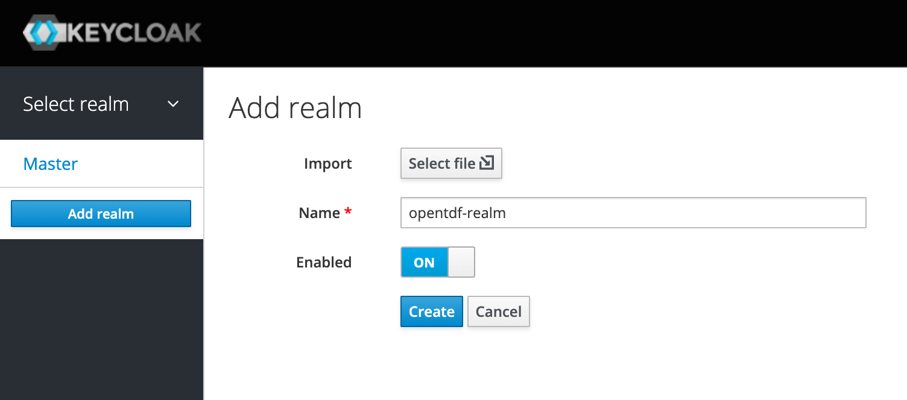

#### Add clients

The clients are web services and applications that use this for authentication.  
The services are `entitlements` and `attributes`.  
The web application is `abacus`.

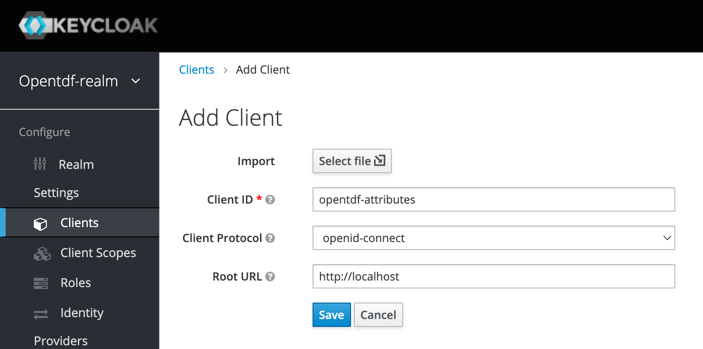

#### Set audience on client

The web application is `abacus` and it requires audiences of `entitlements` and `attributes`.

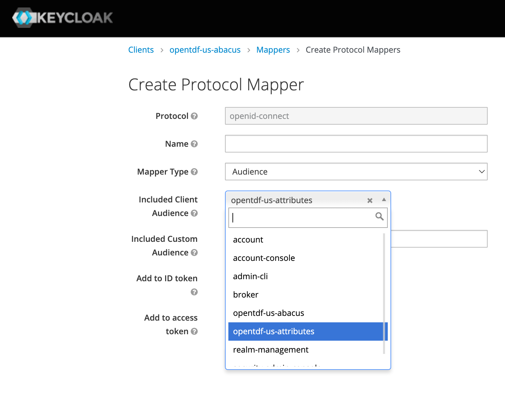

#### Add abacus user

This user will be able to create attributes and entitle.  
Add user and set role for viewing clients and users.

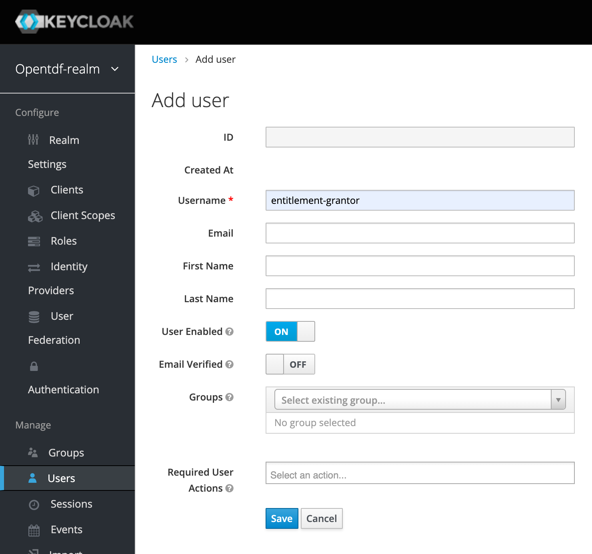

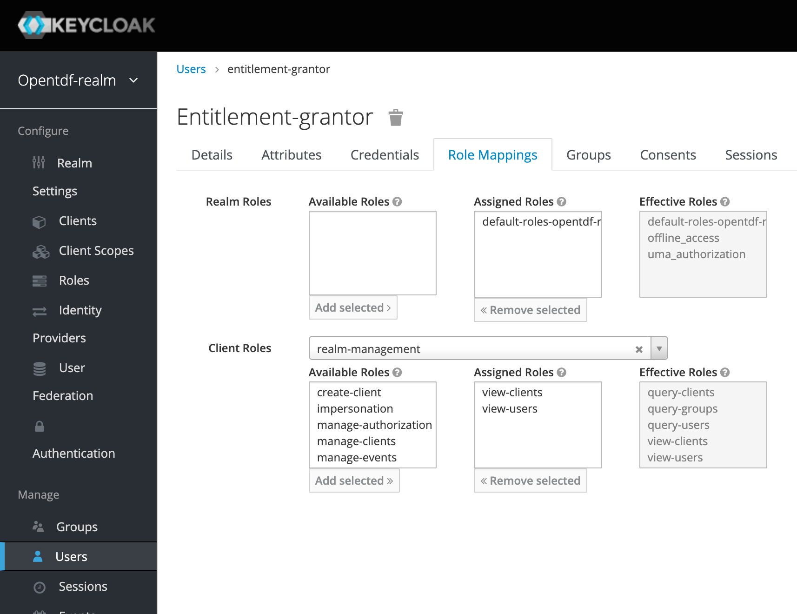

#### Add entity (person, PE)

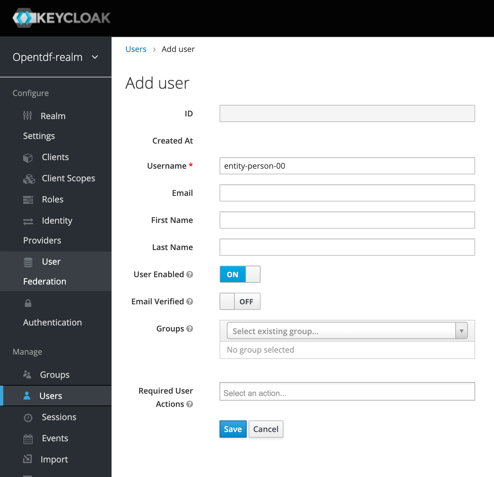

#### Set password on entity (person)

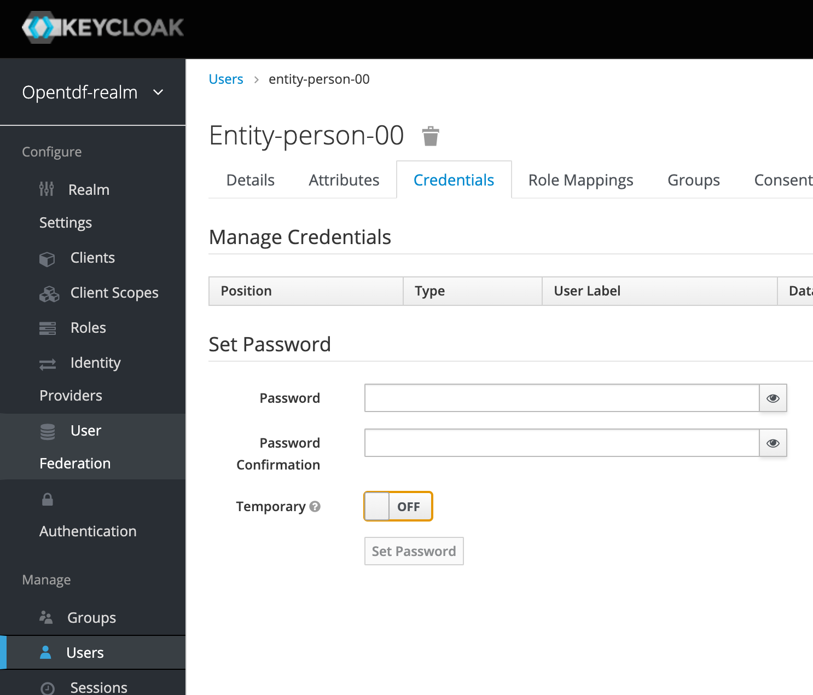

#### Add entity (client, NPE)

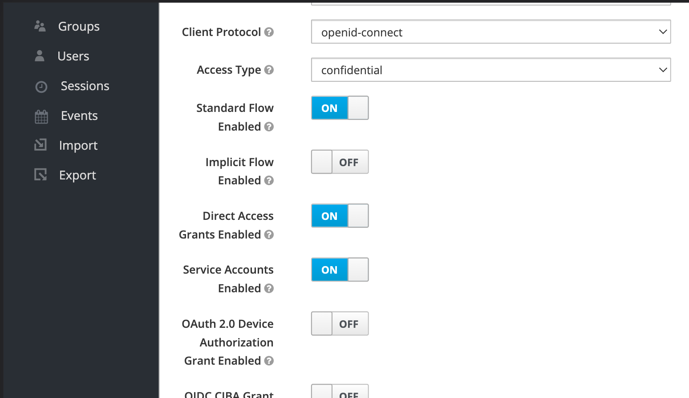

#### Set password on entity (client, NPE)

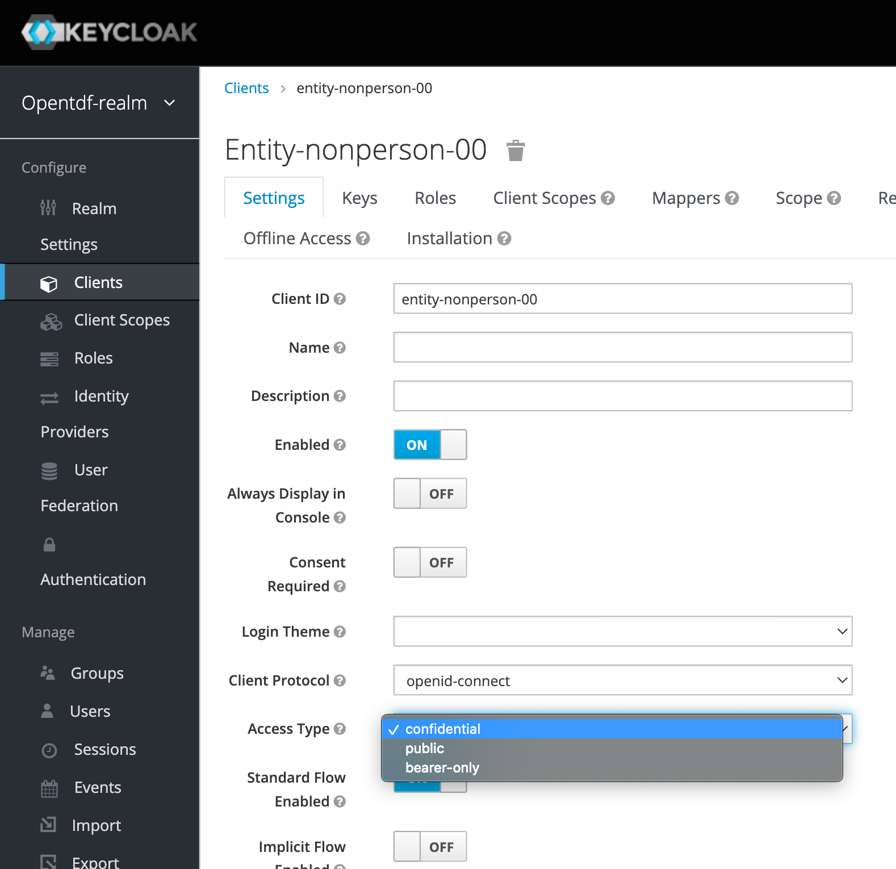

#### Set OIDC User Info Signing

**User Info Signed Response Algorithm** set to RS256 under **Fine Grain OpenID Connect Configuration**

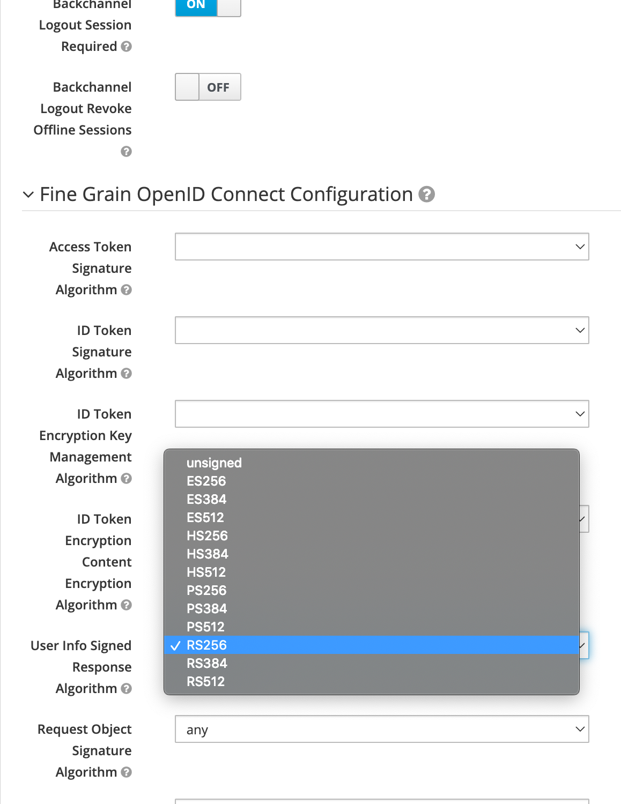

#### Set mapper to apply claims

**Attribute Provider URL** is an internal service (use internal URL)  
**Token Claim Name** must be `tdf_claims`

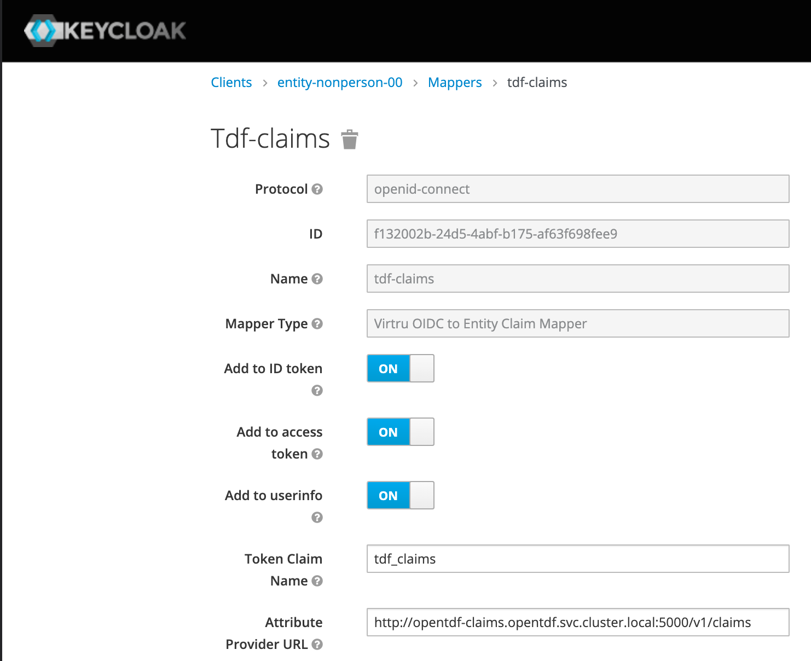
